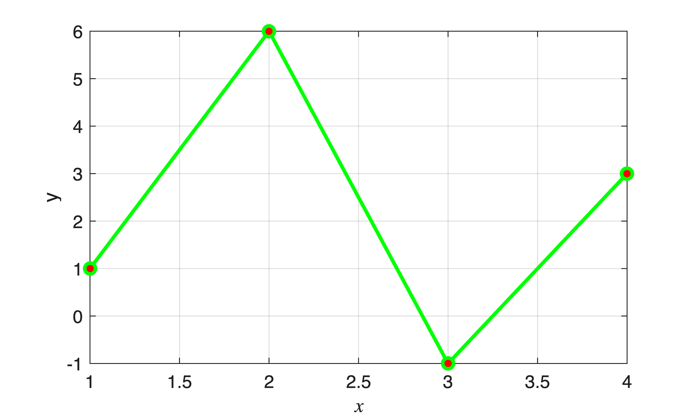
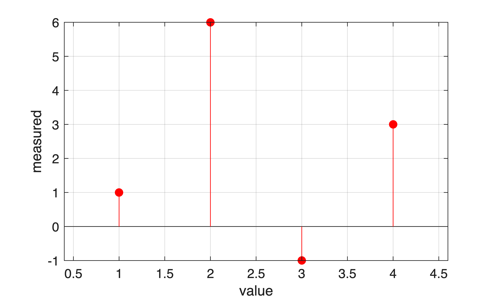
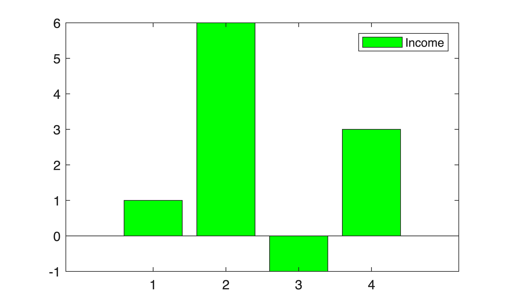

# 배열 행렬 만들기

이름: 최 병 조 

-  벡터와 행렬을 만드는 방법 
-  행렬 연산 
-  행렬의 일부 
-  그래프 
-  소리 파일 다루기 
# 간단한 배열
-  벡터: 열벡터, 행벡터 
-  행렬: 2차원 배열 
```matlab
 m = [1 4 2 5] % 행 벡터, row vector
```

```matlabTextOutput
m = 1x4

1    4    2    5    

```

```matlab
 v = [1; 6; -1; 3] % 열 벡터, column vector
```

```matlabTextOutput
v = 4x1

1     
6     
-1    
3     

```

```matlab
 M = [1 3 5; 2 4 6]
```

```matlabTextOutput
M = 2x3

1    3    5    
2    4    6    

```

```matlab
 m = M(2,2)
```

```matlabTextOutput
m = 4
```

## 행렬의 크기
-  명령어: `size`, `length`, `numel` 
```matlab
M
```

```matlabTextOutput
M = 2x3

1    3    5    
2    4    6    

```

```matlab
whos M
```

```matlabTextOutput
  Name      Size            Bytes  Class     Attributes

  M         2x3                48  double              
```

```matlab
[nRows, nCols] = size(M)
```

```matlabTextOutput
nRows = 2
nCols = 3
```

```matlab
nn = size(M, 2)
```

```matlabTextOutput
nn = 3
```

```matlab
N = M'
```

```matlabTextOutput
N = 3x2

1    2    
3    4    
5    6    

```

```matlab
ln = length(N)
```

```matlabTextOutput
ln = 3
```

```matlab
kk = numel(M)
```

```matlabTextOutput
kk = 6
```

# 그래프
-  명령어: `plot`, `stem`, `bar` 
```matlab
v
```

```matlabTextOutput
v = 4x1
     1
     6
    -1
     3

```

```matlab
h = plot(v, 'g-o', "MarkerFaceColor","r")
```

```matlabTextOutput
h = 
  Line with properties:

              Color: [0 1 0]
          LineStyle: '-'
          LineWidth: 0.5000
             Marker: 'o'
         MarkerSize: 6
    MarkerFaceColor: [1 0 0]
              XData: [1 2 3 4]
              YData: [1 6 -1 3]

  Show all properties

```

```matlab
h.LineWidth = 2;
grid on;
xlabel("$x$","Interpreter","latex"); 
ylabel("y")
```



stem 그래프

```matlab
stem(v, 'r', 'filled');
grid;
xlabel("value"); ylabel("measured")
```



bar 막대 그래프

```matlab
bar(v, "FaceColor", "g")
legend("Income")
```


# 복소수 배열 / Complex Arrays
-  허수 / imaginary number 
-  $\displaystyle i=\sqrt{-1}$ 
```matlab
a = 2i + 1
```

```matlabTextOutput
a = 1.0000 + 2.0000i
```

```matlab
aR = real(a), aImag = imag(a)
```

```matlabTextOutput
aR = 1
aImag = 2
```

```matlab
b = [1 2i 2+1i -1]
```

```matlabTextOutput
b = 1x4 complex
1.0000 + 0.0000i   0.0000 + 2.0000i   2.0000 + 1.0000i  -1.0000 + 0.0000i

```

```matlab
b1 = b(1), b2 = b(2)
```

```matlabTextOutput
b1 = 1
b2 = 0.0000 + 2.0000i
```

```matlab
b2 = b.^2
```

```matlabTextOutput
b2 = 1x4 complex
1.0000 + 0.0000i  -4.0000 + 0.0000i   3.0000 + 4.0000i   1.0000 + 0.0000i

```

# Array Addressing
```matlab
v = 10:-2:0
```

```matlabTextOutput
v = 1x6
    10     8     6     4     2     0

```

```matlab
v(1:2), v(end-1:end)
```

```matlabTextOutput
ans = 1x2
    10     8

ans = 1x2
     2     0

```

```matlab
v(1:2:end)
```

```matlabTextOutput
ans = 1x3
    10     6     2

```

```matlab
u = v([2 4 1 3 6 5])
```

```matlabTextOutput
u = 1x6
     8     4    10     6     0     2

```

```matlab
M = magic(5)
```

```matlabTextOutput
M = 5x5
    17    24     1     8    15
    23     5     7    14    16
     4     6    13    20    22
    10    12    19    21     3
    11    18    25     2     9

```

```matlab
m = M(end, :)
```

```matlabTextOutput
m = 1x5
    11    18    25     2     9

```

```matlab
w = M(:, 3)
```

```matlabTextOutput
w = 5x1
     1
     7
    13
    19
    25

```

```matlab
d = M(4:5, [2 4])
```

```matlabTextOutput
d = 2x2
    12    21
    18     2

```

```matlab
v
```

```matlabTextOutput
v = 1x6
    10     8     6     4     2     0

```

```matlab
v(10) = 8
```

```matlabTextOutput
v = 1x10
    10     8     6     4     2     0     0     0     0     8

```

## 배열을 만드는 또 다른 방법
```matlab
q = (9:-2:3) + 1
```

```matlabTextOutput
q = 1x4
    10     8     6     4

```

```matlab
r = linspace(0, 10, 6)
```

```matlabTextOutput
r = 1x6
     0     2     4     6     8    10

```

```matlab
g = logspace(0, 4, 5)
```

```matlabTextOutput
g = 1x5
           1          10         100        1000       10000

```

```matlab
b = 0:4, z = 2.^b
```

```matlabTextOutput
b = 1x5
     0     1     2     3     4

z = 1x5
     1     2     4     8    16

```

# 특별한 행렬
-  `zeros`, `ones`, `magic`, `eye` 
```matlab
U = zeros(3, 4)+ pi
```

```matlabTextOutput
U = 3x4
    3.1416    3.1416    3.1416    3.1416
    3.1416    3.1416    3.1416    3.1416
    3.1416    3.1416    3.1416    3.1416

```

```matlab
Y = ones(2)*3
```

```matlabTextOutput
Y = 2x2
     3     3
     3     3

```

```matlab
M = magic(6)
```

```matlabTextOutput
M = 6x6
    35     1     6    26    19    24
     3    32     7    21    23    25
    31     9     2    22    27    20
     8    28    33    17    10    15
    30     5    34    12    14    16
     4    36    29    13    18    11

```

```matlab
dm = diag(diag(M))
```

```matlabTextOutput
dm = 6x6
    35     0     0     0     0     0
     0    32     0     0     0     0
     0     0     2     0     0     0
     0     0     0    17     0     0
     0     0     0     0    14     0
     0     0     0     0     0    11

```

```matlab
E = eye(3)*4
```

```matlabTextOutput
E = 3x3
     4     0     0
     0     4     0
     0     0     4

```

```matlab
E2 = E^2
```

```matlabTextOutput
E2 = 3x3
    16     0     0
     0    16     0
     0     0    16

```

